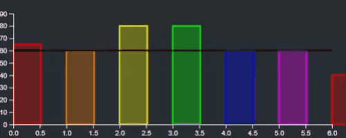

# React & D3 DemoGraph Application

Demo .

## Features

The project demonstrate the usage of React with D3 liberty. Usually these two libraries compete over the rendering, however the React is used for the rendering and D3 for te calculations of the SVG paths (rectangles).
The following demo application presents a bar chart. The Y axis represent an amount of some productivity while the X axis represents a month. The chart also displays average line while interactive by the user. It also has zooming features. Once the data is ready to be displayed a fade animation is used. Another feature is that on hover of a single bar the color opacity should be changed to focus the user on the column. The user can always click on a bar to show the data.

## Stack

In the project project the following technologies have been used.

##### Code

- [D3](https://d3js.org/) (scaleLinear, axisBottom, axisLeft, line, zoom etc')
- React Hooks (useEffect, useState, Custom Hooks )
- [Animations](https://www.react-spring.io/) Used react-spring animations (animated.rect, useSpring etc');
